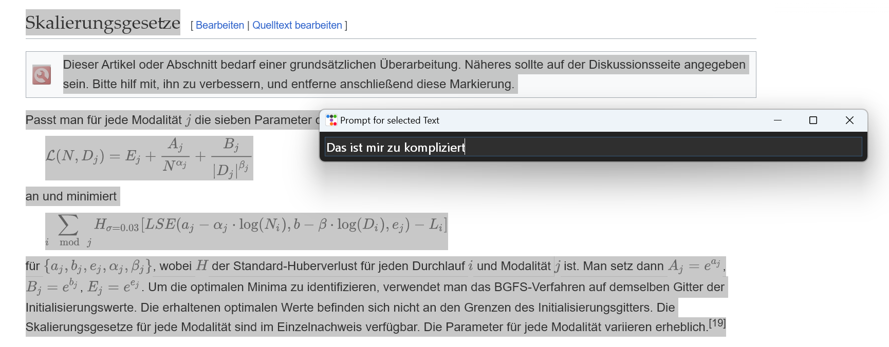

# Text Companion

## Let LLMs work on text without leaving the current app
Are you familiar with **DeepL's desktop tool** for on the fly translations?
The Text Companion tool works in similar ways. You select some text in any
application and either pop up the **action menu with ctrl-alt-g** or the
**prompt entry field with ctrl-alt-f**.
The Compation calls the LLM for you and displays the result. No manual copy&paste necessary anymore.

## Actions: recurring tasks made easy
Put your preferred LLM text processing actions (prompts) into profiles, which you can switch between at runtime.
For example, you could have a profile for English, one for German, one for fun stuff, etc.
An action did not work as expected? A new action comes to mind? Just edit the profile, press the _Reload_ button and run again.

When the action hotkey is pressed and *Action popup* is checked, the Companion displays a menu at the
current mouse position. The next image depicts a text selection in Wikipedia and
the menu after pressing the hotkey. Once an action is selected, the Companion makes the browser copy the selection
into the clipboard, and then it fetches the clipboard content. 
- If *Auto call* is switched on, it calls the LLM immediately.
- If *Write back* is switched on, the output gets typed into the application that has keyboard focus.

### Individual prompt on the spot
Mark some text in any app and press the prompt hotkey.
The Companion opens a prompt entry field at the mouse position and you can start typing immediately.

Type in the prompt and press ENTER. The Companion will fetch the currently selected text in the active application and execute the prompt on it.

### Other features
- The Companion can be configured to stay on top of all windows. See profile-default.toml.
- The hotkeys can be configured in profile-default.toml. Mind you that it is not easy to find free keys that work in the relevant applications.

## OpenAI Models
The Companion can use the chat models, however not in a chat-like fashion -  nobody needs yet another chatbot.
The companion keeps no history of the conversation with the model, which would be required to make it "chatty". 
It provides one-shot Q&A dialog similar to a function call.
## Prerequisites
I've used Python 3.11. 3.10 or lower may work as well. There are no dependencies on 3.11 features as far as I know. 
## Platforms
Developed and tested under Windows 11. Tested under macOS Ventura 13.
## Installation
`pip install -r requirements.txt`
### macOS
1. Install py2pp with `pip install py2app`
2. Create macOS app bundle with `python setup.py py2app -A` [^1]
3. Start the macOS bundle in dist folder
4. Enable "Input Monitoring" in System > Privacy & Security > Input Monitoring for Text Companion ([Platform limitations — pynput 1.7.6 documentation](https://pynput.readthedocs.io/en/latest/limitations.html))

[^1]: Alias mode (the -A or --alias option) instructs py2app to build an application bundle that uses your source and data files in-place. It does not create standalone applications, and the applications built in alias mode are not portable to other machines.

## Configuration

The environment variable OPENAI_KEY must contain your OpenAI API key.

The program is configured through profile files in TOML format. The default profile is **profile-default.toml**.
Custom profiles are collected during startup by reading all files with the .toml extension.

To define a new profile:

* Create a new .toml file in the program's directory
* Use the default profile as a template for the syntax of the properties.
* Mandatory: *settings.name*
* Mandatory: *actions*

## Run

`python3 main.py`

The program must be run in its directory, otherwise the configuration profiles will not be found.

## More about the *write back* feature 
To edit text in-place, switch on *Write back*. After the LLM response is complete, the Companion will first
try to type, select, and copy the first character. Then it checks whether the clipboard contains excactly this
character. In that case, the application with keyboard focus is editable.

This probing technique is pretty safe. If the source app is read-only, not much can go bad. It is just one key followed
by shift-left and ctrl-c (cmd-c on Mac). 

Still, you need to be patient while the Companion is running and not move the focus someplace else.

**Things get a little nasty when the LLM takes forever to respond. As the API has no means to interrupt the current request,
you should kill the Companion first, before changing focus to another app.**