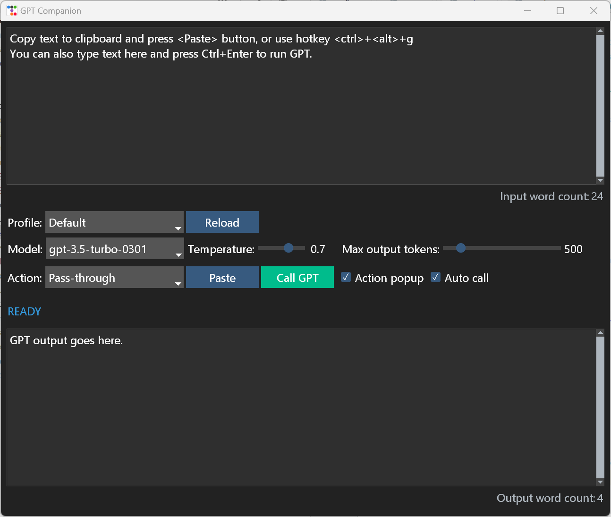

# GPT-3 Companion

## What it does

Are you familiar with DeepL's desktop tool for on the fly translations?
The GPT Companion tool works in similar ways. You select some text in a source
application and press the configurable hotkey crtl-alt-g. The Companion will
call GPT-3 for you and display the result.

Configure your preferred GPT-3 text processing actions into profiles, which you can switch between at runtime.
For example, you could have a profile for English, one for German, one for fun stuff, etc.
An action did not work as expected? A new action comes to mind? Just edit the profile, press the _Reload_ button and run GPT again.

With the hotkey it can display a popup menu with the actions at the
mouse position in any application. This feature is configurable.

The companion is more convenient than using ChatGPT or OpenAI Playground
where you'll have to copy&paste the text yourself and fiddle with the
same prompts over and over again. Just run the Companion, put it aside and feed it with text.

The Companion can also stay on top of all windows, which is also configurable.

## OpenAI Chat Models

The Companion can use the chat models, however not in a chat-like fashion. The OpenAI API
has a specific endpoint for chat models, which works differently than the other models.
The companion keeps no history of the Q&A with the model, which would be required to make it "chatty".

The chat models must be listed separately in a profile config. See __profile-default.toml__ about how to do it.

## Prerequisites

Python 3.11

## Platforms

Tested and developed under Windows 11

*I'm doing my best for the MacOS version. Without having a Mac myself, this is a bit of a challenge.*.

## Installation

`pip install -r requirements.txt`

To allow the Companion read the keyboard and mouse on MacOS, please see the section _MacOS_ under [Platform limitations — pynput 1.7.6 documentation](https://pynput.readthedocs.io/en/latest/limitations.html)

## Configuration

The environment variable OPENAI_KEY must contain your OpenAI API key.

The program is configured through profile files in TOML format. The default profile is **profile-default.toml**.
Custom profiles are collected during startup by reading all files with the .toml extension.

To define a new profile:

* Create a new .toml file in the program's directory
* Use the default profile as a template for the syntax of the properties.
* Mandatory: *settings.name*
* Mandatory: *actions*

## Run

`python3 main.py`

The program must be run in its directory, otherwise the configuration profiles will not be found.
